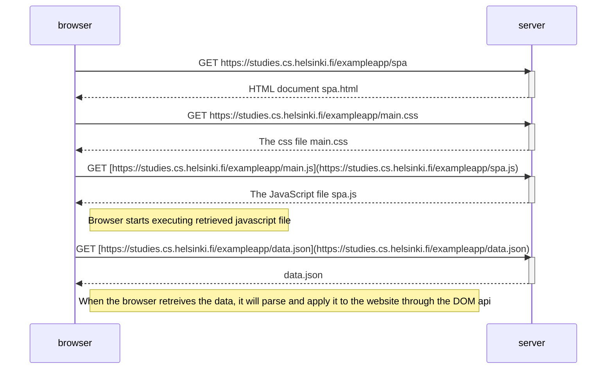

```mermaid
sequenceDiagram
    participant browser
    participant server
    
    browser->>server: GET https://studies.cs.helsinki.fi/exampleapp/spa
    activate server
    server-->>browser: HTML document spa.html
    deactivate server
    
    browser->>server: GET https://studies.cs.helsinki.fi/exampleapp/main.css
    activate server
    server-->>browser: The css file main.css
    deactivate server
    
    browser->>server: GET [https://studies.cs.helsinki.fi/exampleapp/main.js](https://studies.cs.helsinki.fi/exampleapp/spa.js)
    activate server
    server-->>browser: The JavaScript file spa.js
    deactivate server

    Note right of browser: Browser starts executing retrieved javascript file
  
    browser->>server: GET [https://studies.cs.helsinki.fi/exampleapp/data.json](https://studies.cs.helsinki.fi/exampleapp/data.json)
    activate server
    server-->>browser: data.json
    deactivate server    
    
    Note right of browser: When the browser retreives the data, it will parse and apply it to the website through the DOM api
```
